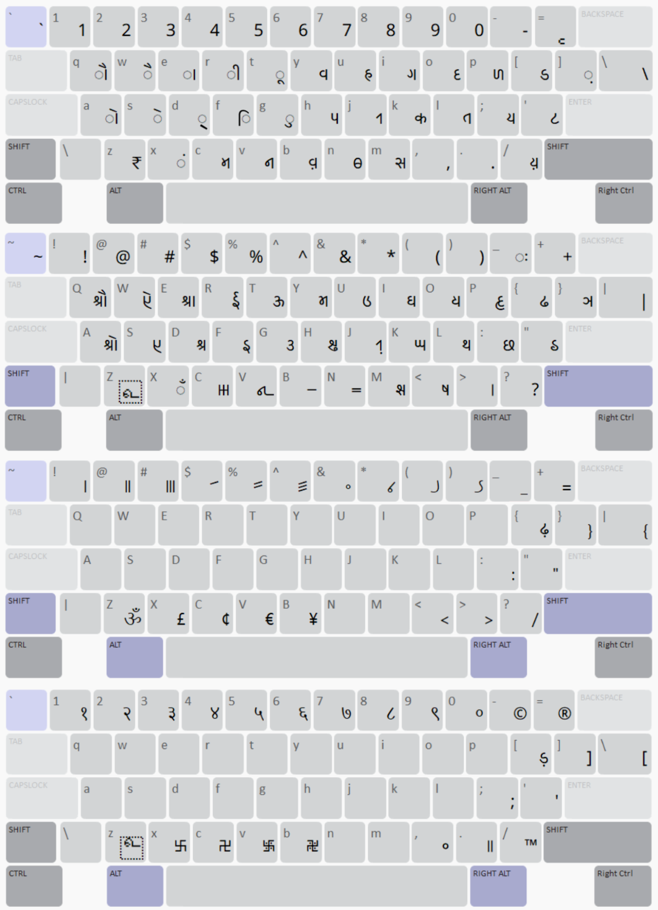
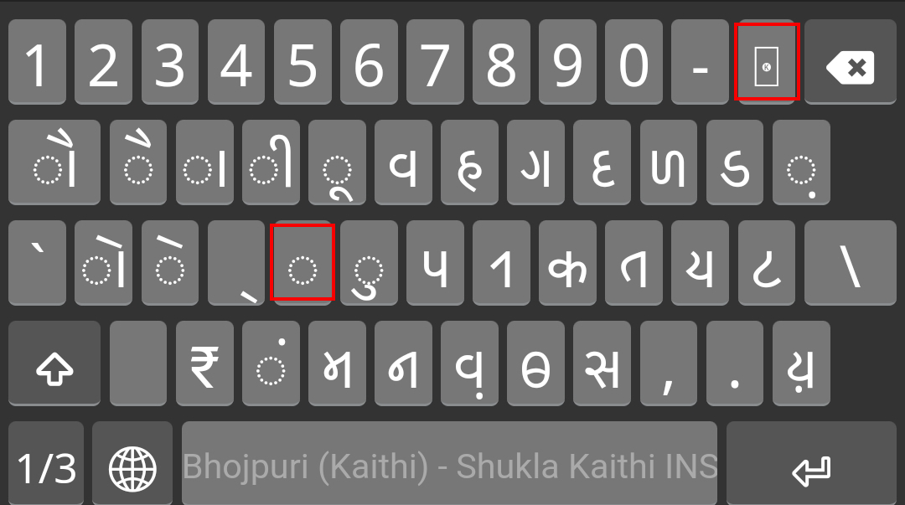

# परिचय
नमस्कार सभी! हमने इस क्रमानुदेश को सभी भोजपुरी तथा अन्य बिहारी सम्बन्धित भाषाओं के भाषियों के लिए विकसित किया है।

&nbsp;

# उपयोग से पूर्व कुछ महत्त्वपूर्ण जानकारी
* इस क्रमानुदेश को आप सभी प्रचालन तंत्र पर उपयोग कर सकते हैं, जैसै की विंडोज, लिनक्स, एंड्रॉइड, आईओएस, मैकओएस आदि।
* यह कुंजीपटल इनस्क्रिप्ट पर आधारित है, अधिक जानकारी के लिए [यहाँ](https://www.tdil-dc.in/index.php?option=com_vertical&parentid=12&lang=en "सीडैक टीडीआईएल") पढ़ें।
* इस कुंजीपटल में हमने कैथी लिपि, सामान्य इंडिक संख्या प्रपत्र, तिब्बती स्वस्तिक, ॐ, ₹ चिन्ह, तथा अन्य प्रयोज्य चिन्हों को अंकित किया है।
* इस क्रमानुदेश में चित्रपट स्थित कुंजीपटल को भी जोड़ा गया है।
* इस क्रमानुदेेश में सभी आवश्यक फॉन्टों को डाला गया है।
* इस कुंजीपटल का ख़ाका निम्नानुसार है-

&nbsp;

&nbsp;

# अधिष्ठापन के चरण
1. सर्वप्रथम कीमैन क्रमानुदेश को [यहाँ](https://keyman.com/14/ "कीमैन १४.०") से अधोभार तथा अधिष्ठान करें।
1. कीमैन अधिष्ठापन उपरांत हमारे क्रमानुदेेश को अधिष्ठान करें तथा अपने संगणक में अधिष्ठापित अन्य कुंजीपटलों में से **शुक्ल कैथी इनस्क्रिप्ट** को चुनकर उसका उपयोग करें। (यह चरण विंडोज, लिनक्स तथा मैकओएस पर लागू होता है।)
1. एंड्रॉइड पर अधिष्ठापन के लिए [यहाँ](https://help.keyman.com/developer/current-version/guides/distribute/install-kmp-android "कीमैन एंड्रॉइड") पढ़ें।
1. आईओएस पर अधिष्ठापन के लिए [यहाँ](https://help.keyman.com/developer/current-version/guides/distribute/install-kmp-ios "कीमैन आईओएस") पढ़ें।
1. यदि आपकेे एंड्रॉइड या आईओएस यंत्र पर अक्षर के स्थान पर टोफू (&#x10FFEE;) दिखे तो निश्चिंत रहें; यह क्रमानुदेश की नहीं, बल्कि फॉन्ट की कमी है क्योंकि कैथी के लिए गिने-चुने फॉन्ट ही बने हैं। कुंजीपटल ख़ाका में दर्शाए गए सभी अक्षरों को सही फॉन्ट के प्रयोग के साथ संगणक पर टंकण किया जा सकता है। 

&nbsp;

&nbsp;

# निष्कर्ष
यह विश्व का सम्भवतः सर्वप्रथम कैथी कुंजीपटल है। इसे हमने कई महीनों के अनुसंधान उपरांत आपके समक्ष प्रस्तुत किया है। आशा करते हैं की यह कुंजीपटल आपके कार्य में आपकी सहायता करने में सक्षम होगा। कोई शिकायत हो तो अवश्य बताएँ। धन्यवाद🙏🏼

&nbsp;

&nbsp;

# Introduction
Hello Everyone!  
We have developed this software for all Bhojpuri and related Bihari languages speakers.

&nbsp;

# Some Important Information Before Application
* This software can be used on every operating system, like Windows, Linux, Android, iOS, macOS, etc.
* This keyboard is based upon INSCRIPT, for more information read [here](https://www.tdil-dc.in/index.php?option=com_vertical&parentid=12&lang=en "CDAC TDIL").
* We have inserted the Kaithi script, Common Indic Number Forms, Tibetan Swastika, ॐ, ₹ symbol, and other useful symbols in this keyboard software.
* We have also added on-screen keyboard in this keyboard software.
* All necessary fonts have been embedded in the package.
* The layout of the keyboard is like [this](./Shukla-Kaithi-INSCRIPT-Layout.png "Shukla Kaithi INSCRIPT Layout").

&nbsp;

# Installation Steps
1. First of all, download and install the Keyman application from [this link](https://keyman.com/14/ "Keyman 14.0").
1. After installing Keyman, install our software and then select **Shukla Kaithi INSCRIPT** from all the other keyboards installed on your computer and use it. (This step applies to Windows, Linux and macOS).
1. For the Installation guide of Android, read [here](https://help.keyman.com/developer/current-version/guides/distribute/install-kmp-android "Keyman Android").
1. For the Installation guide of iOS, read [here](https://help.keyman.com/developer/current-version/guides/distribute/install-kmp-ios "Keyman iOS").
1. If you see [tofu](./Keyboard-Tofu.png "Keyboard Tofu")(&#x10FFEE;) instead of characters on your Android or iOS device then don't worry; it's not the shortcoming of the software, but instead of the font because there aren't many fonts available for the Kaithi script. All the characters shown in the Keyboard layout can be typed on the system using appropriate fonts.

&nbsp;

# Conclusion
This is probably the world's first Kaithi keyboard. We have presented this to you after months of research. We hope this keyboard is capable of assisting you in your tasks. Please let us know if you have any complaints. Thanks🙏🏼
